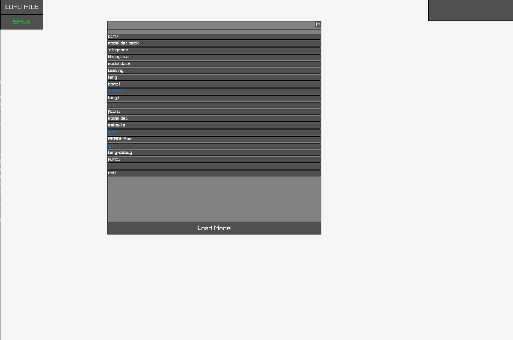
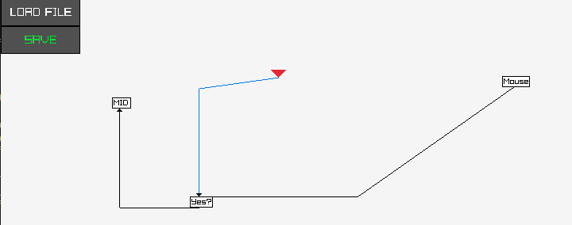
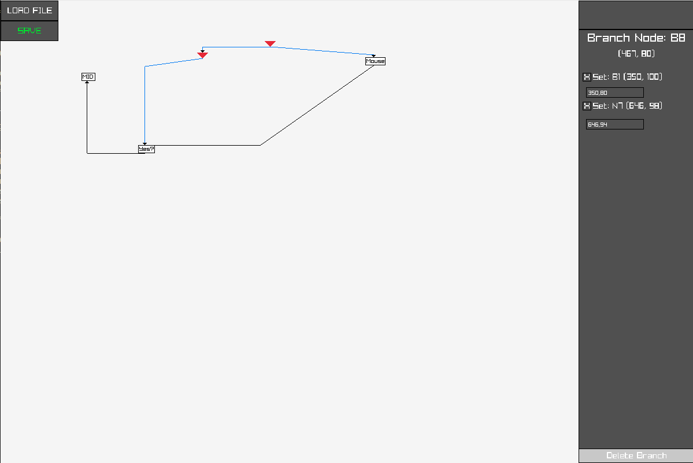
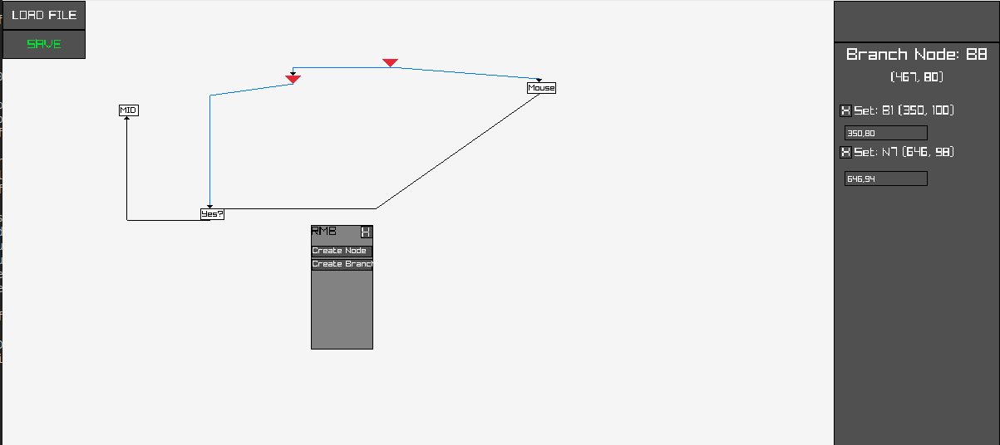
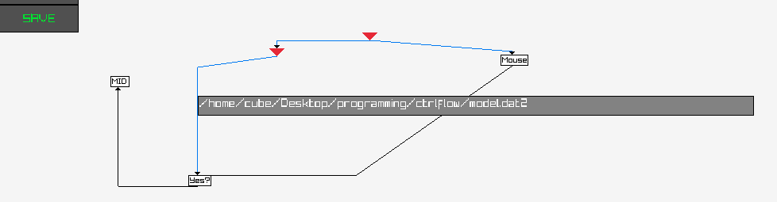

# Control Flow Graph Made for Dummies - CoFGMaD

## Dependencies
|Program|Version|
|-------|-------|
|Raylib |  v5.5 |
|cutils | current commit |

## Images of the program:
### Initial Screen:

### Load Model:
When loading the model, you can browse the file system. Click on the file to select the model. Note the blue text represent directories. If you click on a directoy it will open the directory.
Click on Load Model button to load the model into the current view.

### Add to model/view model info:

Left-click the node to see additional information about the node/branch. In the right hand panel you can modify the midpoints of links, delete links, or delete the node.

To add new nodes to the model press right-click and select the type you want to add. Branch can link to 2 nodes, node can link to one node. All nodes can have any number of incoming links.

To link a node right-click on an existing node and then left-click on the node you want to link it to.

### Save model:
To save the model, press the green SAVE button in the top left corner. Type in the path to the location you want to save it and press enter.

## language
WIP